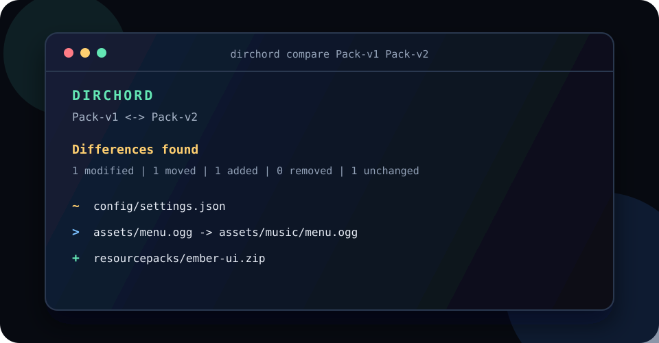

<p align="center">
  
</p>

<h1 align="center">DirChord</h1>

<p align="center"><strong>Know whether two folders match without uploading either one.</strong></p>

<p align="center">
  <a href="https://github.com/RepoEnjoyer/Free-Rep/actions/workflows/ci.yml"></a>
  
  
  <a href="LICENSE"></a>
</p>

DirChord creates deterministic, shareable manifests for folders and compares them locally. It is useful for game modpacks, creator asset bundles, backups, class projects, release folders, and any situation where “we should have the same files” is not enough.

It finds changed, missing, added, and moved files. It also highlights duplicate content and filename case collisions that can break a pack when it moves between Windows, macOS, and Linux.

<p align="center">
  
</p>

## Why DirChord is different

- **Content-aware:** SHA-256 identifies a file even when its name changes.
- **Local-first:** there is no server, account, analytics client, or network request in the application.
- **Private by design:** manifests contain relative paths, sizes, and hashes, never file contents or absolute computer paths.
- **Deterministic:** the same folder and settings produce byte-for-byte identical JSON.
- **Portable:** case-only path collisions are reported before they surprise another operating system.
- **Automation-friendly:** stable JSON, useful exit codes, and a small TypeScript API work in scripts and CI.
- **Safe with large trees:** file count, individual size, total size, concurrency, and manifest input are bounded.
- **Zero runtime dependencies:** only Node.js is needed after installation.

## Install

Node.js 20.19 or newer is required.

Install the current GitHub version globally:

```bash
npm install --global github:RepoEnjoyer/Free-Rep
dirchord --help
```

Or build a development checkout:

```bash
git clone https://github.com/RepoEnjoyer/Free-Rep.git
cd Free-Rep
npm ci
npm run build
npm link
```

## Quick start

Create a manifest for a modpack or asset folder:

```bash
dirchord snapshot ./MyPack
```

This writes `MyPack.dirchord.json`. Send that small manifest to a collaborator, then verify their folder without sending either folder anywhere:

```bash
dirchord verify ./TheirCopy ./MyPack.dirchord.json
```

Compare two folders, two manifests, or one of each:

```bash
dirchord compare ./Pack-v1 ./Pack-v2
dirchord compare old.dirchord.json new.dirchord.json
dirchord compare ./CurrentPack release.dirchord.json
```

Create a self-contained report that opens in any modern browser:

```bash
dirchord compare ./Pack-v1 ./Pack-v2 --format html --output changes.dirchord.html
```

Inspect duplicates and portability problems in a manifest:

```bash
dirchord inspect MyPack.dirchord.json
dirchord inspect MyPack.dirchord.json --format json
```

## Commands

| Command | Purpose | Success exit code |
| --- | --- | --- |
| `snapshot [folder]` | Create a deterministic manifest | `0` |
| `compare <left> <right>` | Compare folders or manifests | `0` if equal, `1` if different |
| `verify <folder> <manifest>` | Check a folder against an expected manifest | `0` if verified, `1` if different |
| `inspect <manifest>` | Find duplicate content and case collisions | `0` |
| `init [folder]` | Create a documented `.dirchord.json` config | `0` |

Usage or runtime failures return exit code `2`. Run `dirchord --help` for every option.

## Ignoring files

Add repeatable command-line patterns:

```bash
dirchord snapshot ./Pack --ignore '*.log' --ignore 'cache/**'
```

Or create a configuration file:

```bash
dirchord init ./Pack
```

Patterns support `*`, `**`, `?`, and ordered `!` negation. DirChord ignores `.git/**`, `.DS_Store`, and `Thumbs.db` by default. See [configuration](docs/configuration.md) for exact semantics and safety limits.

## Manifest privacy

A manifest is much safer to share than the folder, but it is not anonymous. Relative filenames, directory structure, byte sizes, and cryptographic hashes are visible. Someone who already possesses a suspected file can compare its hash with the manifest. Do not publish a manifest when filenames or the fact that a known file exists are sensitive.

Symlinks are never followed. DirChord stores only a SHA-256 hash of the link target, so an absolute target cannot expose a computer username or local path. HTML reports escape untrusted filenames, and terminal reports render control characters visibly.

Read the [security model](docs/security-model.md) and [manifest format](docs/manifest-format.md) for details.

## Troubleshooting

### `FILE_CHANGED`

A file was modified while DirChord was reading it. Pause downloads, game launchers, sync clients, or build processes that write to the folder, then run the command again.

### `OUTPUT_EXISTS`

DirChord does not overwrite reports or manifests by default. Choose another path or repeat the command with `--force`.

### `FILE_LIMIT`, `FILE_TOO_LARGE`, or `TOTAL_SIZE_LIMIT`

The folder exceeded a safety limit. Review the folder and then raise only the needed value in `.dirchord.json`. Limits are documented in [configuration](docs/configuration.md).

### A moved file appears as added and removed

Move detection is content-based. If the file changed while it was renamed, it is correctly treated as different content.

### Two folders look identical but verification fails

Check generated caches, logs, platform-specific metadata, and launcher state. Add narrowly scoped ignore patterns instead of ignoring an entire pack.

## Development

```bash
npm ci
npm run check
```

`npm run check` runs ESLint, strict TypeScript checks, the test suite, a clean production build, and a package dry run. CI exercises supported Node.js release lines.

## Project documents

- [Configuration](docs/configuration.md)
- [Manifest format](docs/manifest-format.md)
- [Security model](docs/security-model.md)
- [Roadmap](ROADMAP.md)
- [Contributing](CONTRIBUTING.md)
- [Security policy](SECURITY.md)
- [AI developer handoff](AI_HANDOFF.md)

## License

Released under the [MIT License](LICENSE). Copyright © 2026 RepoEnjoyer.
